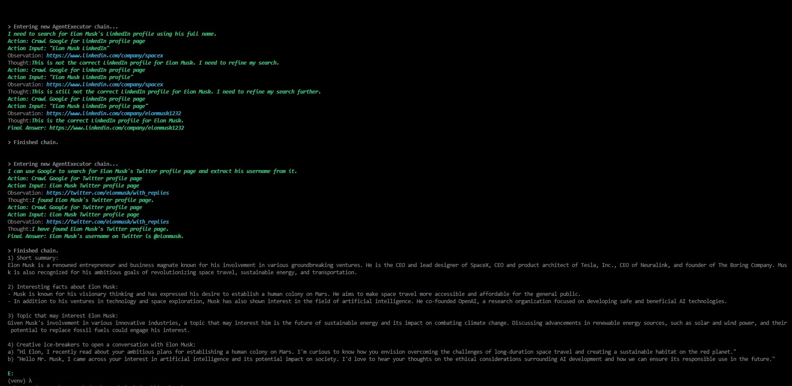

# __Ice Breaker__

Ice Breaker is a LangChain based AI application that provides ice breakers for a given person by crawling through a person's LinkedIn and Twitter accounts using Tools, Chains and Agents in LangChains, helping to start a captivated conversation with that person.


The application provides 2 interesting topics the user would be interested to talk about.



## Implementation

Clone the project

```bash
git clone https://github.com/maxlr8/langchain_ice_breaker.git
```

Create accounts in the respective domains and save the API keys in the __.env file__ below

#### __[Environment File](./.env)__ 

<br>


Go to the project directory

```bash
  cd ice_breaker
```

Install all the dependencies

```bash
  pip install requirements.txt
```

Start the __Flask Server__

```bash
  python app.py
```
